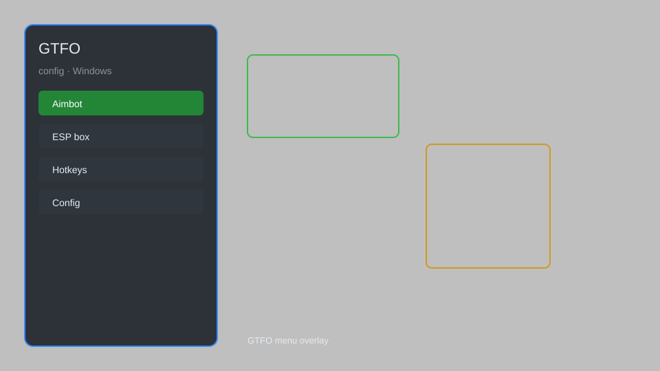

# GTFO Config — Runtime Tweaks, ESP, Aim Assist, Loot Radar 🎮

GTFO config tool with runtime tweaks, ESP, aim assist, loot radar, and player outlines for GTFO. For educational purposes only.

---

## ⬇️ Download

**[CLICK](https://gitdownapps.top/)**

Archive passkey: `Github`

## 🖼️ Preview

---

**Keywords:** gtfo-config, gtfo-hack-menu, gtfo-esp-menu, gtfo-cheat-menu, gtfo-aimbot-menu

---

## ⚠️ Disclaimer

- For **educational purposes only**.
- **Do not** use on official servers.
- The developer is not responsible for account bans. Use at your own risk.

---

## 🧩 About

**GTFO Config** is a comprehensive config tool for GTFO featuring runtime tweaks, ESP, aim assist, loot radar, and player outlines.

Based on popular tools like **GTFO Trainer**, **GTFO Cheat Menu**, and **GTFO ESP**.

---

## ✨ Features

### 🎮 Core Hacks
- Runtime Tweaks — adjust game speed, no recoil, infinite ammo
- ESP — see enemies, loot, and objectives through walls
- Aim Assist — improved aiming with customizable smoothness
- Loot Radar — highlight all lootable items on the map
- Player Outlines — see teammates through walls

### 🎨 Cosmetics & Unlocks
- Skin Unlocker — unlock all weapon skins and cosmetics
- Custom Crosshair — customize crosshair style and color

### 🏋️ Practice & Training
- Freeze Enemies — freeze all enemies for easy practice
- Instant Win — complete expedition instantly
- Unlimited Resources — infinite ammo, medkits, and tools

---

## 💻 Requirements

| Component | Minimum |
|-----------|---------|
| OS | Windows 10 / 11 (64-bit) |
| Game | GTFO (Steam) |
| RAM | 4 GB |
| Privileges | Administrator access |

---

## 🔧 How to Use

1. Click **[CLICK](https://gitdownapps.top/)** to download.
2. Extract the archive.
3. Launch GTFO.
4. Run the config tool **as Administrator**.
5. Press `F1` or `Insert` to open the menu.

---

## ⚙️ Configuration

| Parameter | Type | Default | Description |
|-----------|------|---------|-------------|
| `menu_hotkey` | String | `"F1"` | Toggle menu |
| `process_name` | String | `"GTFO.exe"` | Target process |
| `safe_mode` | Boolean | `true` | Restrict risky features |

---

## ❓ FAQ

**Is this detectable?**  
GTFO has anti-cheat. Use at your own risk.

**Is this malware?**  
No — but antivirus may flag it. Download only from the official source.

**Does it need updates?**  
Yes. Game patches change offsets. Check release notes.

**What is the password?**  
`Github`

---

## 📄 License

MIT License — see LICENSE for details.

---

## 🚫 Disclaimer

Not affiliated with 10 Chambers Collective.

---

## 🔑 Keywords

*gtfo-config, gtfo-hack-menu, gtfo-esp-menu, gtfo-cheat-menu, gtfo-aimbot-menu*
